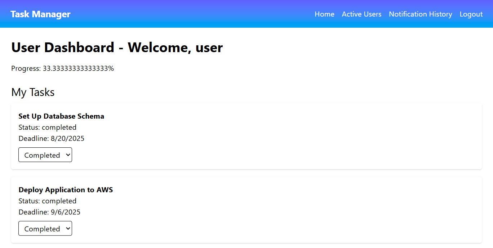

# Task Management System

**Live:** https://task-management-system-1-877v.onrender.com/  
**Video:** https://youtu.be/3kssfeSwrk0?si=s_nGP_JahiHGkKd0  
**Repo:** https://github.com/Sandipon-Biswas/Task-Management-System  

## Features
- Admin can assign tasks to any user  
- User can update task status: Pending → In Progress → Completed  
- Show active users and their names  
- Notifications saved in History tab  

## Demo Login to access
- **Admin:** `Username: admin` / `Password: admin`  
- **User:** `username: user` / `Passwrod: user`  

## How to Test (Step by Step)
1. Login as **Admin** → assign task to any user  
2. Login as **User** → check tasks → change status  
3. Go to **Active Users** → see all online users  
4. Open **History** → view notifications  
# Task Management System

## Screenshots

 

